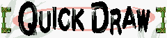

# Reflex Showdown

Multiplayer duel reaction game 🗡️

    

## Be the faster swordsman!

This proyect is based on the minigame [Samurai Kirby](https://kirby.fandom.com/wiki/Samurai_Kirby) from [Kirby Super Star](https://en.wikipedia.org/wiki/Kirby_Super_Star), which has a pretty simple premise: wait patiently for the signal to attack, and react faster than your opponent to win!

Each player gets a time measurement in milliseconds, with support for up to 6 player matches on local multiplayer or against CPU controlled opponents. The game also supports touch/mouse controls, so that it can be played on mobile 📱!

<b>Behind the scenes 🎥</b>

Having played the original game in my childhood, one night on christmas 2019 while hanging out with friends we saw the original Kirby Super Star available on the Nintendo Switch Online service. We were puzzled to find out that Samurai Kirby worked kinda well as a party game, but was of course lacking features to support that, so I set out to make a simple browser clone of it!
    
However, as the new year came around, so did my finals, and what little code I stubbed on this repo stagnated here collecting dust. Now, over 3 years later, here stands a finished and improved version! 

