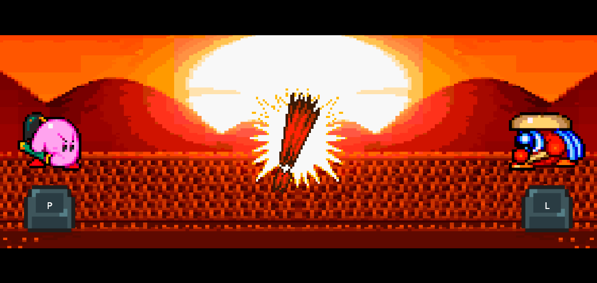

# Reflex Showdown

    Multiplayer duel reaction game 🗡️
     
    
    

## Be the faster swordsman!

This proyect is based on the minigame [Samurai Kirby](https://kirby.fandom.com/wiki/Samurai_Kirby) from [Kirby Super Star](https://en.wikipedia.org/wiki/Kirby_Super_Star), which has a pretty simple premise: wait patiently for the signal to attack, and react faster than your opponent to win!

Each player gets a time measurement in milliseconds, with support for up to 6 player matches on local multiplayer or against CPU controlled opponents. The game also supports touch/mouse controls, so that it can be played on mobile 📱!

## Singleplayer mode

Singleplayer can be played against up to 5 cpu controlled opponents. Each of these reacts within a random time window, averaging less than half a second. As a consequence, the more cpu opponents you play against, the harder each duel is, as it becomes more likely that one of them will have a smaller reaction time.

## Local multiplayer

In a similar fashion, local multiplayer can be played by any number of players ranging from 2 to 6. Only the fastest one of them will win the duel, and a time ranking with marks for every player will be shown after each match.

Touch and mouse controls are supported as well, each player having its surrounding area react to input.

<b>Behind the scenes 🎥</b>

Having played the original game in my childhood, one night on christmas 2019 while hanging out with friends we saw Kirby Super Star was available on the Nintendo Switch Online service. We were puzzled to find out that Samurai Kirby worked kinda well as a party game, but was of course lacking features to support that, so I set out to make a simple browser clone of it!
    
However, as the new year came around, so did my finals, and what little code I stubbed on this repo stagnated here collecting dust. Now, over 3 years later, here stands a finished and improved version! 

